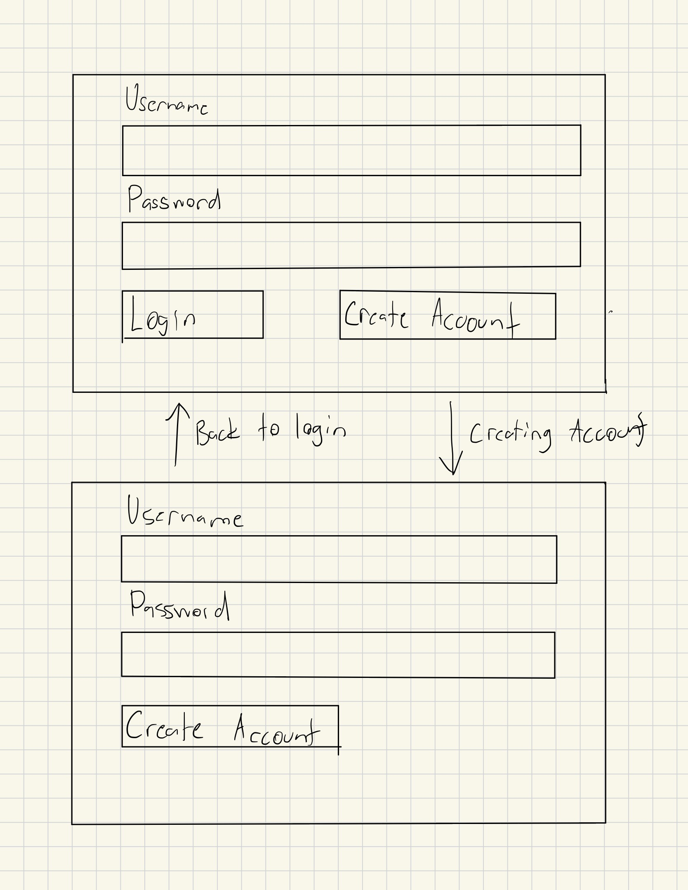
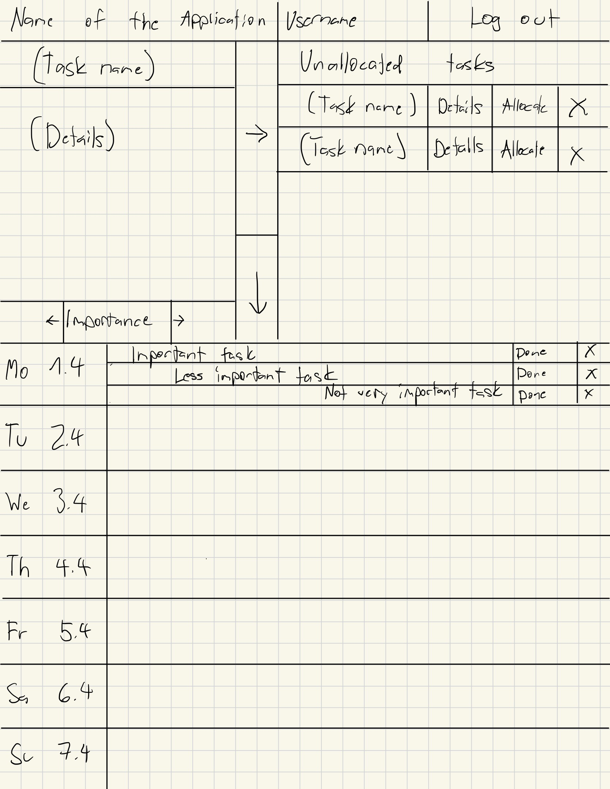
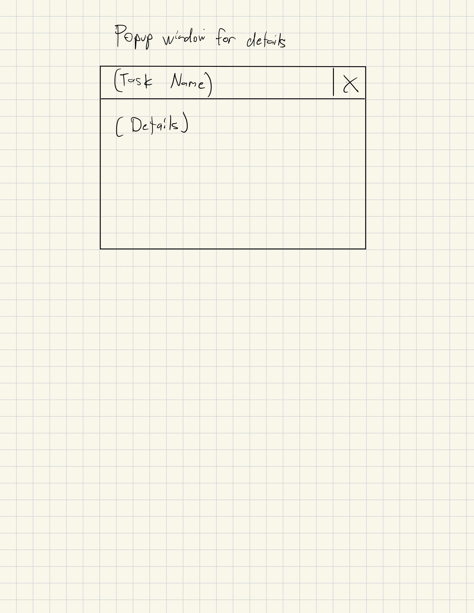

# Vaatimusmäärittely

## Sovelluksen tarkoitus

Sovelluksen on tarkoitus toimia kalenterina, johon kirjataan pääsääntöisesti tapahtumien sijaan tehtäviä, jotka pitäisi sen päivän aikana tehdä. Tehtävät voi luokitella sen mukaan, miten tärkeitä ne ovat. Sovelluksen on tarkoitus auttaa käyttäjää ajanhallinnassa ja aikaansaamisessa.

## Käyttäjät

Sovelluksessa tulee olemaan kaksi käyttäjäroolia: _normaali käyttäjä_ ja _ylläpitäjä_. _Normaali käyttäjä_ pystyy hallinnoimaan omaa kalenteriaan, kun taas _ylläpitäjä_ voi hallinnoida kaikkien käyttäjien kalentereita ja poistaa käyttäjiä.

## Käyttöliittymäluonnos

Sovellus koostuu kolmesta eri näkymästä
Kirjautumisnäkymä

Päänäkymä

Yksityiskohtien ponnahdusikkuna

Sovellus aukeaa kirjautumisnäkymään, josta on mahdollista siirtyä uuden käyttäjän luomisnäkymään tai onnistuneen kirjautumisen yhteydessä kirjaantuneen käyttäjän päänäkymään. Jos haluaa tarkastella yksityiskohtia, aukeaa ponnahdusikkuna, jossa näkyy tehtävän nimi ja yksityiskohdat.

## Perusversion tarjoama toiminnallisuus

### Ennen kirjautumista

- [x] Käyttäjä voi luoda järjestelmään käyttäjätunnuksen, johon liittyy myös salasana 
    - [x] Käyttäjätunnuksen täytyy olla uniikki 
- [x] Käyttäjä voi kirjautua järjestelmään
    - [x] Kirjautuminen onnistuu jos käyttäjätunnus ja salasana ovat kirjattu järjestelmään
    - [x] Kirjautuminen ei onnistu, jos käyttäjätunnusta ei ole rekisteröity

### Kirjautumisen jälkeen

- [x] Käyttäjä näkee oman kalenterinsa ja siihen tallennetut tehtävät
- [x] Käyttäjä voi luoda uuden tehtävän
  - [x] Luotu tehtävä näkyy ainoastaan sen luoneelle käyttäjälle
  - Tehtävä voi jäädä ikkunaan sovelluksessa, jossa on kaikki tehtävät, joita ei ole vielä lisätty millekään päivälle
  - Tehtävän voi siirtää suoraan kalenteriin
- [x] Käyttäjä voi merkitä tehtävän tehdyksi
- Käyttäjä voi luokitella tehtävät tärkeyden mukaan
- [x] Käyttäjä voi merkitä tehtävään lisätietoja
- [x] Käyttäjä voi poistaa tehtävän
- [x] Käyttäjä voi kirjautua ulos järjestelmästä

## Jatkokehitysideoita

Perusversion jälkeen järjestelmää täydennetään ajan salliessa esim. seuraavilla toiminnallisuuksilla:

- Tehdyksi merkittyjen tehtävien tarkastelu
- Jos tehtävä ei tule tehdyksi päivän aikana, se siirtyy seuraavalle päivälle automaattisesti
- Tehdyksi merkittyjen tehtävien merkkaaminen tekemättömiksi, jolloin ne palautetaan ikkunaan, jossa on sijoittamattomat tehtävät
- Käyttäjä pääsee tarkastelemaan tehtyjä tehtäviä
- Tehtävien tietojen editointi
- Mahdollisuus useampaan erilliseen kalenteriin, samalla käyttäjällä
- Käyttäjätunnuksen poisto
